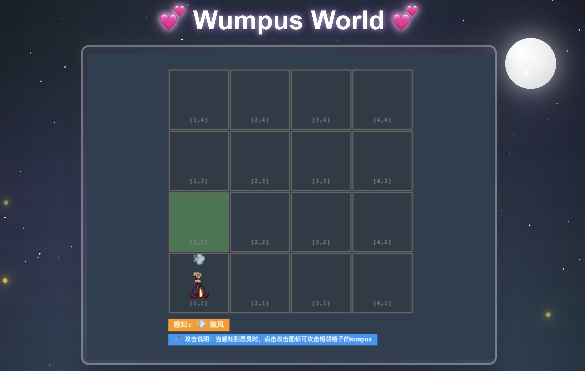
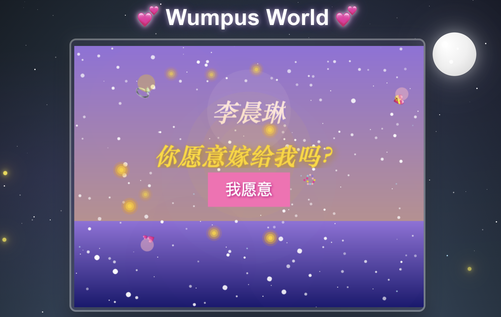

# 💕 Wumpus World Marriage Proposal Game

A romantic twist on the classic Wumpus World puzzle game! When your girlfriend finds the gold, a beautiful marriage proposal surprise will appear on screen. This is a unique and nerdy way to pop the question! 💍




## 🎯 Project Overview

This project transforms the classic AI Wumpus World problem into a romantic adventure. The ultimate goal is to create a memorable and interactive marriage proposal experience by combining logic, adventure, and love.

*Game elements including the player, gold, and environmental clues*

## 🚀 Installation & Setup

### Prerequisites
- **Node.js** (version 16 or higher)
- **npm** or **yarn**

### Installation Steps

1. **Clone the repository**
   ```bash
   git clone https://github.com/0x4ab99BA/wumpus-world-proposal.git
   cd wumpus-world-proposal
   ```

2. **Install dependencies**
   ```bash
   npm install
   ```

3. **Start development server**
   ```bash
   npm run dev
   ```

4. **Open in browser**
   - Navigate to `http://localhost:5173/`
   - The game should load automatically

### Build for Production

To create a production build for deployment:

```bash
npm run build
```

The built files will be in the `dist/` folder, ready to deploy to any web hosting service.

### Preview Production Build

To preview the production build locally:

```bash
npm run preview
```

## 🛠️ Tech Stack

- **Phaser.js** - 2D game engine for smooth animations and interactions
- **TypeScript** - Type-safe development for better code quality
- **Vite** - Fast build tool and development server
- **HTML5 Canvas** - Hardware-accelerated game rendering

## 📁 Project Structure

```
wumpus-world-proposal/
├── src/
│   ├── main.ts              # Game entry point
│   ├── scenes/              # Game scenes
│   │   ├── GameScene.ts     # Main game logic
│   │   └── ProposalScene.ts # Marriage proposal scene
│   ├── objects/             # Game entities
│   ├── assets/              # Game resources
│   │   ├── images/          # Sprites and graphics
│   │   └── audio/           # Sound effects and music
│   └── utils/               # Helper functions
├── index.html               # Main HTML file
├── package.json             # Project configuration
└── README.md               # This file
```

## 🎨 Features

*Interactive gameplay with smooth animations and intuitive controls*

- **Smooth Animations** - Character movement, trap effects, and victory animations
- **Interactive UI** - Mouse-controlled movement with visual feedback
- **Responsive Design** - Works on desktop and mobile devices
- **Romantic Theme** - Custom graphics and romantic color scheme
- **Surprise Element** - Hidden proposal reveal upon winning

## 🤝 Contributing

This is an open-source project! Contributions are welcome:

1. Fork the repository
2. Create a feature branch (`git checkout -b feature/amazing-feature`)
3. Commit your changes (`git commit -m 'Add amazing feature'`)
4. Push to the branch (`git push origin feature/amazing-feature`)
5. Open a Pull Request

## 📄 License

This project is licensed under the MIT License - see the [LICENSE](LICENSE) file for details.

## 💌 Acknowledgments

- Inspired by the classic "Hunt the Wumpus" game by Gregory Yob (1973)
- Built with love for creating unforgettable proposal moments
- Thanks to the Phaser.js community for excellent documentation and examples

---

**Made with ❤️ for unforgettable proposals**

*May your code compile and your love be true! 💕*